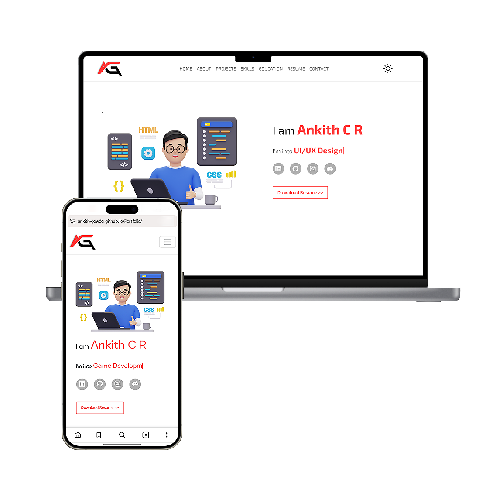

# Portfolio
My self built personal portfolio.

<h2 align="center">
  Personal Portfolio 
  <a href="https://github.com/ankith-gwoda" target="_blank">Ankith C R</a>
</h2>

  

 

## To Access
You can modify this repo and make changes of your own.  
Just give me a proper credit by linking back to [ankith-gowda](https://github.com/ankith-gowda/Portfolio) or mention me.
Thank you!..

## Built with
- HTML5
- CSS3
- JavaScript
- Bootstrap

## Getting Started
Clone this repo. Before that make sure *Git* installed globally in your device. 
Open command prompt and execute, 
'git clone https://github.com/ankith-gowda/Portfolio.git'
After this, all you need to go to the directory where the project is cloned, and can edit.

### Show your Support🙏🏻
Give a ⭐ if you like this project.
Feedback are welcomed.

### You can also follow me on

  
  
  

## Note: This is not a completed website. I'll update it accordingly.
